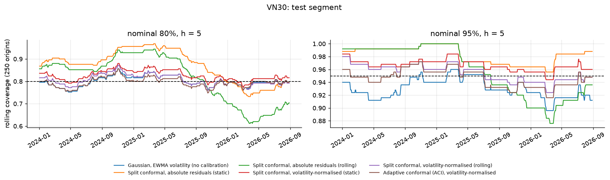

# Time-Series Forecasting: Research & Build

**Do richer models beat "no change" for daily financial returns, and can their uncertainty be
calibrated when volatility shifts?** A small, auditable study on the VN30 index and the BID
stock, with every claim tied to a tested protocol and a committed notebook.

Maintained by [Tuan Tran](https://github.com/tuanthescientist). MIT licensed.
Earlier exploratory notebooks (Bitcoin, BNB, gold, NeuralProphet, Chronos, recurrent nets) are
preserved, unvalidated, on the branch
[`archive/v0.1-exploratory`](https://github.com/tuanthescientist/Timeseries_Forecasting_Research_and_Build/tree/archive/v0.1-exploratory)
(tag `v0.1.0`).

## What to read

| Order | Notebook | Question | One-line answer on the committed run |
| --- | --- | --- | --- |
| 1 | [01 Data and baselines](notebooks/01_data_and_baselines.ipynb) | What are the data, the protocol and the baseline to beat? | Returns are almost unpredictable from their own past; volatility clusters; trailing drift does not beat persistence. |
| 2 | [02 Model comparison](notebooks/02_model_comparison.ipynb) | Do ridge, extra-trees and gradient boosting beat persistence? | No, not significantly, on either series (Holm-adjusted p = 1 for all 24 comparisons). |
| 3 | [03 Uncertainty calibration](notebooks/03_uncertainty_calibration.ipynb) | Do prediction intervals stay calibrated as volatility changes? | Adaptive conformal keeps coverage within ~0.01 of nominal; static calibration over-covers; conditional coverage by volatility regime is still imperfect. |

The notebooks are executed and their outputs are stored, so they can be read on GitHub without
running anything. The protocol is in [`docs/protocol.md`](docs/protocol.md), the data card in
[`docs/data.md`](docs/data.md), and the same numbers in application form are in
[`docs/preliminary_results.md`](docs/preliminary_results.md). The doctoral proposal that uses
this run is [`docs/proposals/PhD_Research_Proposal.md`](docs/proposals/PhD_Research_Proposal.md)
([Word copy](docs/proposals/PhD_Research_Proposal_Tran_Anh_Tuan.docx)).

## Results at a glance

Test segment 2023-01-03 to mid-2026 (912 origins for VN30, 905 for BID). Settings were chosen
on a validation segment (2018-2022 for VN30, 2019-2022 for BID) and frozen before the test
segment was run. All horizons count trading sessions.

**Point forecasts: RMSE of the h-step log return divided by persistence (< 1 beats "no change")**

| Series | Model | h = 1 | h = 5 | h = 20 |
| --- | --- | ---: | ---: | ---: |
| VN30 | trailing drift | 1.0023 | 1.0111 | 1.0415 |
| VN30 | ridge | 0.9976 | 0.9969 | 0.9718 |
| VN30 | extra-trees | 0.9974 | 0.9989 | 0.9736 |
| VN30 | gradient boosting | 0.9963 | 0.9965 | 1.0040 |
| BID | trailing drift | 1.0019 | 1.0084 | 1.0310 |
| BID | ridge | 0.9973 | 0.9897 | 0.9768 |
| BID | extra-trees | 0.9982 | 1.0011 | 1.0065 |
| BID | gradient boosting | 0.9961 | 1.0033 | 1.0155 |

None of these differences is statistically distinguishable from zero (Diebold-Mariano with HAC
variance, block bootstrap, Holm correction). The tentative 2-3% gain of ridge at h = 20 appears
on both series and is a lead for more data, not a finding.

**Interval coverage at h = 5 (target 80% / 95%)**

| Method | VN30 80% | VN30 95% | BID 80% | BID 95% |
| --- | ---: | ---: | ---: | ---: |
| Gaussian, EWMA volatility | 0.802 | 0.929 | 0.824 | 0.938 |
| Split conformal, static | 0.864 | 0.985 | 0.910 | 0.985 |
| Split conformal, rolling, volatility-normalised | 0.808 | 0.957 | 0.807 | 0.943 |
| Adaptive conformal (ACI), volatility-normalised | **0.799** | **0.948** | **0.798** | **0.947** |



Full tables and figures for both series are in [`results/vn30/`](results/vn30) and
[`results/bid/`](results/bid). Negative and mixed results are reported as found; for example,
normalising residuals by trailing volatility reaches the right *average* coverage but
under-covers calm periods (about 0.71-0.74 at the 80% level) and over-covers turbulent ones.

## Reproduce

```bash
git clone https://github.com/tuanthescientist/Timeseries_Forecasting_Research_and_Build.git
cd Timeseries_Forecasting_Research_and_Build
python -m venv .venv && source .venv/bin/activate        # Windows: .venv\Scripts\Activate.ps1
python -m pip install -c requirements-lock.txt -e ".[dev]"
python -m unittest discover -s tests -v                    # integrity tests
python scripts/run_notebooks.py                            # run all three notebooks
```

Python 3.11 or 3.12. Without the market files the notebooks fall back to a **synthetic
series** and print a notice; their numbers then differ from the committed ones. To reproduce the
committed results, place the two files described in [`docs/data.md`](docs/data.md) at
`data/raw/vn30.csv` and `data/raw/bid.csv` (not redistributed; hashes are recorded).
`python scripts/run_notebooks.py --save` writes new outputs into the notebooks and results
into `results/<dataset>/`.

## Integrity checks that are tested

* Forecasts and features at an origin do not change when every later observation is altered.
* A model fitted at origin `o` sees only rows whose longest label is observed by `o`.
* Validation targets end before the test segment starts (embargo of `max(h)` rows).
* Interval calibration uses an outcome only after it is realised (`origin + h <= now`).
* Metrics, Diebold-Mariano size under overlapping errors, block bootstrap, Holm correction,
  and conformal coverage (including recovery after a variance shift) have unit tests.

## Layout

```
notebooks/   01 data and baselines · 02 model comparison · 03 uncertainty calibration
src/tsresearch/
  data.py  features.py  protocol.py  models.py  backtest.py  selection.py
  metrics.py  conformal.py  uncertainty.py  workspace.py
configs/     fixed protocol dates and dataset locations
tests/       temporal-integrity, metric and conformal tests
docs/        protocol, data card, preliminary results, research proposal
results/     tables and figures from the committed real-data run
data/        synthetic demo series; data/raw/ is git-ignored
scripts/     run_notebooks.py, check_repository.py, make_demo_ohlcv.py
```

## Scope and limits

* Two Vietnamese series, one feature family, one test period per series (about 3.7 years) and
  overlapping multi-day targets. The study says nothing about other markets, intraday data or
  market efficiency, and does not evaluate trading profitability or costs.
* The selection rule and dates were fixed before running these models, but the same market
  history had been looked at in earlier informal experiments, so the test segment is not a
  pristine, never-seen sample.
* Provider, retrieval date and terms of the two market files are not recorded in the files;
  the VN30 file has four weekend-dated rows (see [`docs/data.md`](docs/data.md)).
* The adaptive conformal update with delayed feedback is a heuristic; the coverage guarantees
  of the original algorithm are not claimed.

## Where this is going

This repository is the evaluation core for a doctoral proposal with two questions: conditional
coverage of prediction intervals when volatility regimes change, and, only after that, an
evidence-checked report that cannot state a number the packet does not contain
([proposal](docs/proposals/PhD_Research_Proposal.md)). The next experiment is a volatility
scale aimed at the conditional-coverage failure already measured here. Further assets, the
archived neural models, and the report layer are later. None of those extensions is
implemented in this commit.

## Citation

See [`CITATION.cff`](CITATION.cff). Please cite the repository together with the exact commit.
